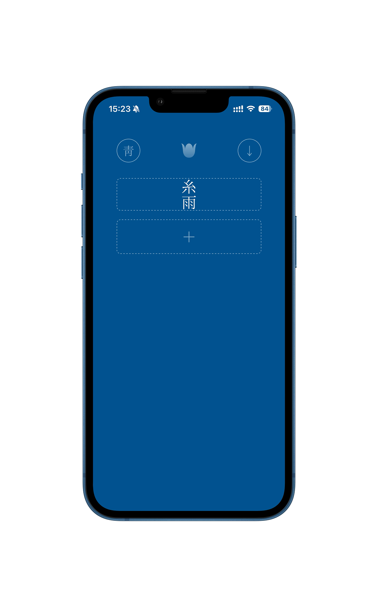
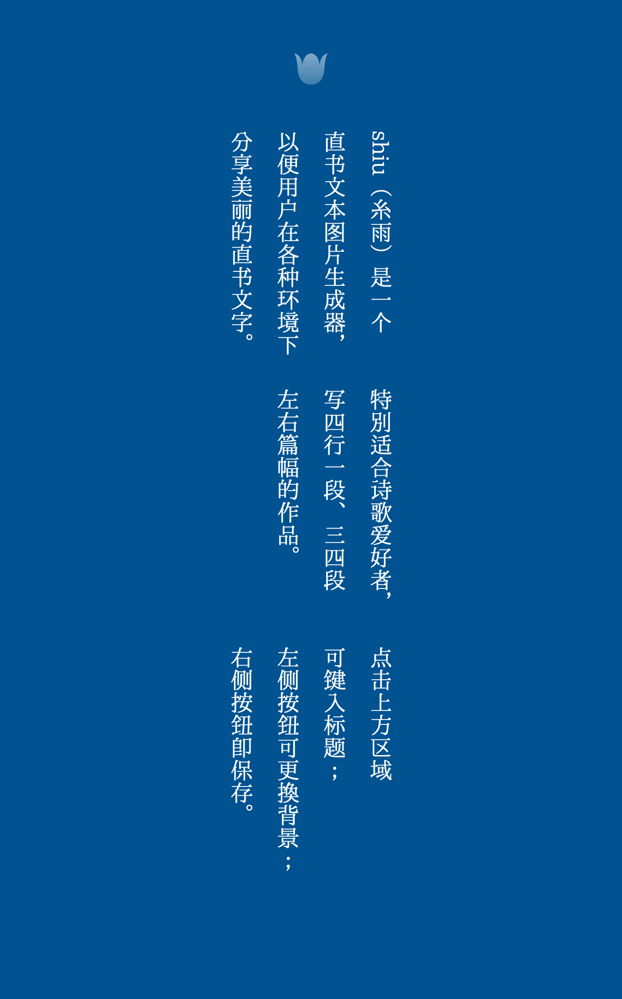
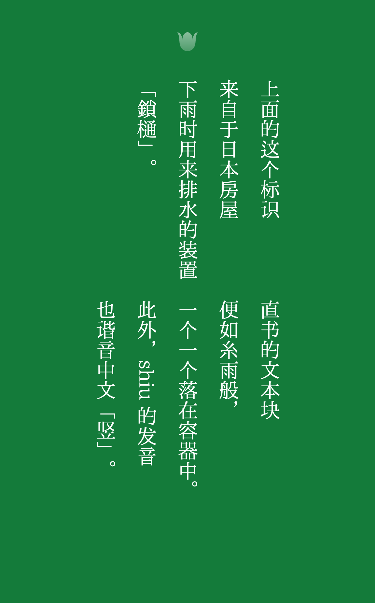
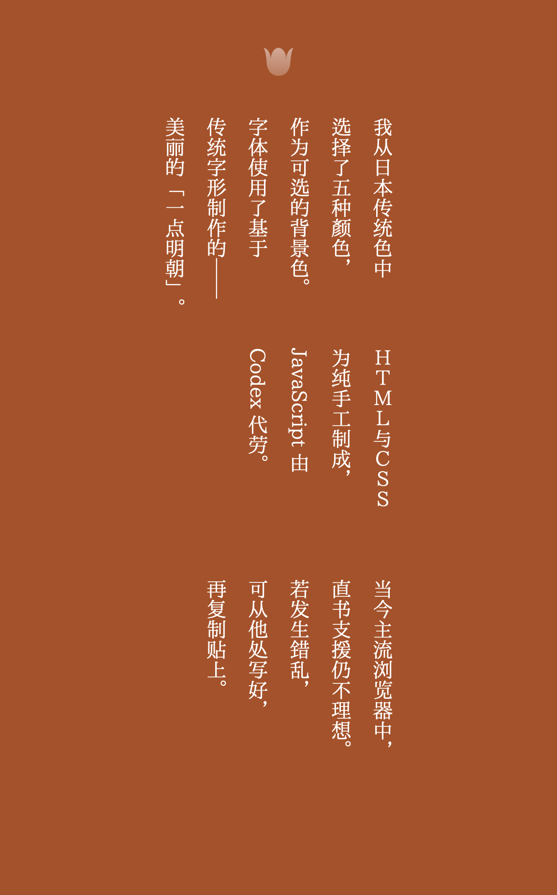
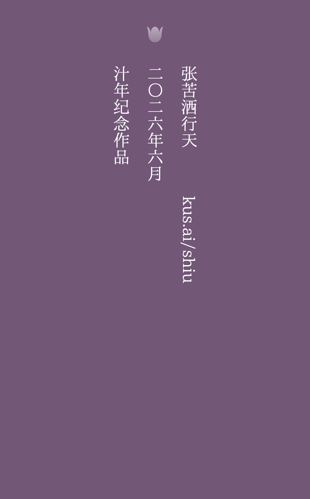

  

  

  

  

  

shiu（糸雨）是一个直书文本图片生成器，以便用户在各种环境下分享美丽的直书文字。特别适合诗歌爱好者，写四行一段、三四段左右篇幅的作品。点击上方区域可键入标题；左侧按钮可更换背景；右侧按钮即保存。

上面的这个标识来自于日本房屋下雨时用来排水的装置「鎖樋」。直书的文本块便如糸雨般，一个一个落在容器中。此外，shiu 的发音也谐音中文「竖」。

我从日本传统色中选择了五种颜色，作为可选的背景色。字体使用了基于传统字形制作的——美丽的「一点明朝」。

ＨＴＭＬ与ＣＳＳ为纯手工制成，JavaScript 由 Codex 代劳。

当今主流浏览器中，直书支援仍不理想。若发生错乱，可从他处写好，再复制贴上。

张苦洒行天  
二〇二六年六月  
汁年纪念作品

---

shiu (糸雨) is a vertical text image generator designed to help users share beautiful vertically written text across different environments. It is especially suited for poetry lovers writing works of around three to four stanzas, with four lines each.

Click the upper area to enter a title; the button on the left changes the background; the button on the right saves the image.

The symbol above comes from the Japanese architectural feature known as “kusari-doi” (鎖樋), which is used to guide rainwater downward from rooftops. The blocks of text fall into the container one by one, like threads of rain. In addition, the pronunciation of “shiu” echoes the Chinese word for “vertical” (竖).

I chose five colors from traditional Japanese color palettes as selectable background colors. The font used is the beautiful I.Ming, created based on traditional character forms.

The HTML and CSS were handcrafted from scratch; the JavaScript was left to Codex.

Support for vertical writing in today’s browsers is still imperfect. If the layout becomes distorted, it is recommended to write elsewhere first and then copy and paste the text in.

Kusa Zhang Xingtian  
June 2026  
Celebrating 30 Years

## Acknowledgements

- [html-to-image](https://github.com/bubkoo/html-to-image)
- [I.Ming Webfont](https://github.com/ichitenfont/I.MingWebfont)
